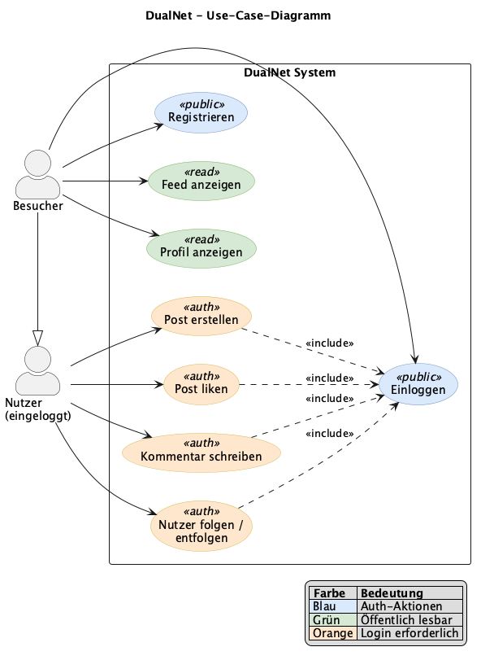
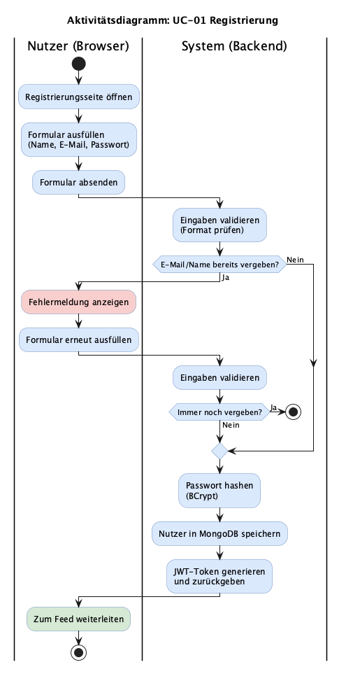
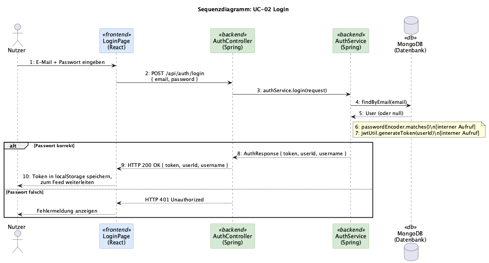
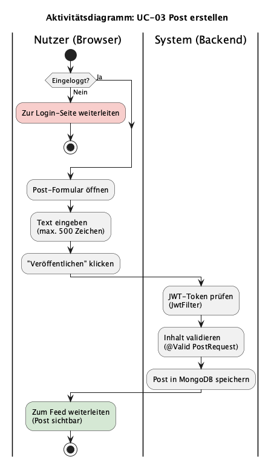
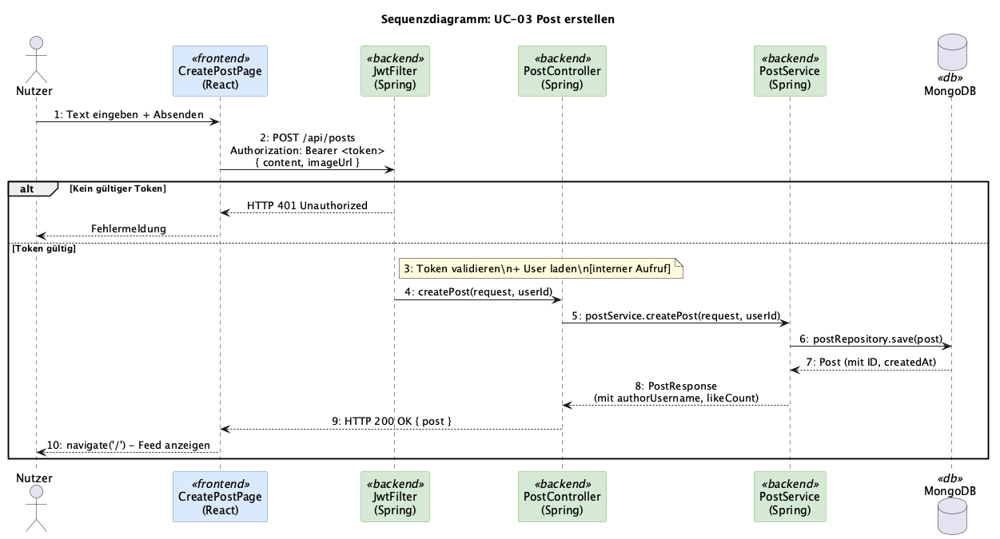
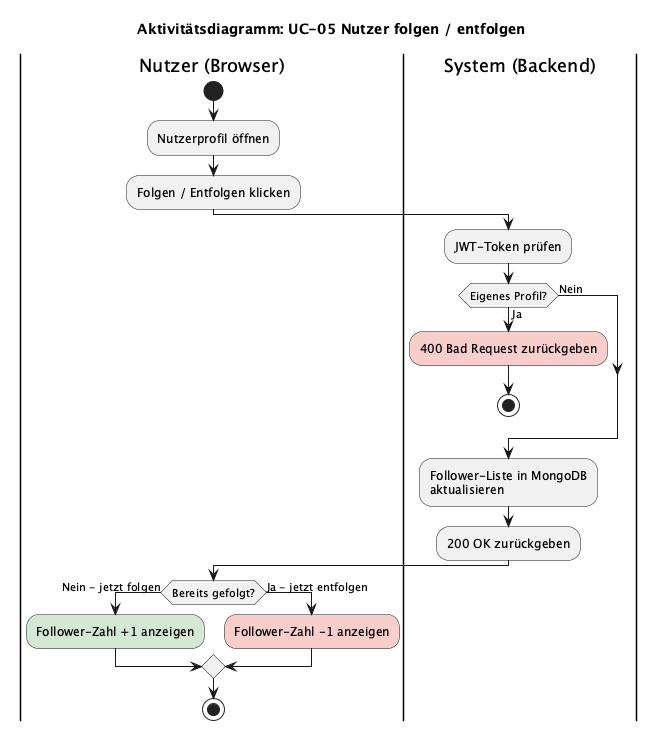

# Software Requirements Specification (SRS)
## DualNetworking (DualNet)

**Version:** 1.0
**Datum:** 2025-10-21
**Team:** TINF24B4

---

## 1. Einführung

### 1.1 Zweck
Dieses Dokument beschreibt die funktionalen und nicht-funktionalen Anforderungen der Social-Media-Plattform DualNet.

### 1.2 Projektumfang
DualNet ist eine Web-Applikation, auf der Nutzer Beiträge veröffentlichen, anderen Nutzern folgen und miteinander interagieren können.

### 1.3 Definitionen

| Begriff | Bedeutung |
|---------|-----------|
| Nutzer | Registrierter Benutzer der Plattform |
| Post | Textbeitrag eines Nutzers, optional mit Bild |
| Feed | Chronologische Übersicht aller Posts |
| JWT | JSON Web Token – wird für Authentifizierung verwendet |

---

## 2. Funktionale Anforderungen

### 2.1 Use-Case-Diagramm

*Exportiert aus: [uml/use-case-diagram.drawio](uml/use-case-diagram.drawio)*

### 2.2 UI-Mockups

> TODO: App starten (`./start.sh`) und Screenshots in `docs/screenshots/` ablegen.
> Benötigt: `login.png`, `feed.png`, `create-post.png`, `profile.png`, `comments.png`

Screenshots der laufenden Anwendung als Referenz für die Hauptfunktionen:

| Screen | Datei |
|--------|-------|
| Login-Seite |  |
| Feed-Ansicht |  |
| Post erstellen |  |
| Profil-Ansicht |  |
| Kommentar-Bereich |  |

---

### 2.3 User Stories

| ID | Als ... | möchte ich ... | damit ... | Priorität |
|----|---------|----------------|-----------|-----------|
| US-01 | Besucher | mich registrieren können | ich die Plattform nutzen kann | Hoch |
| US-02 | Besucher | mich einloggen können | ich auf mein Konto zugreifen kann | Hoch |
| US-03 | Nutzer | einen Post erstellen können | ich meine Gedanken teilen kann | Hoch |
| US-04 | Nutzer | den Feed sehen können | ich Posts anderer Nutzer lesen kann | Hoch |
| US-05 | Nutzer | einem anderen Nutzer folgen können | ich seinen Content verfolgen kann | Mittel |
| US-06 | Nutzer | einen Post liken können | ich Zustimmung zeigen kann | Mittel |
| US-07 | Nutzer | einen Kommentar schreiben können | ich auf Posts reagieren kann | Mittel |
| US-08 | Nutzer | ein Nutzerprofil anzeigen können | ich mehr über andere Nutzer erfahren kann | Mittel |
| US-09 | Nutzer | ein Profilbild hochladen können | mein Profil persönlicher wirkt | Mittel |
| US-10 | Nutzer | eine Kurzbio auf meinem Profil hinterlegen können | andere Nutzer mich besser kennenlernen können | Mittel |
| US-11 | Nutzer | auf Kommentare anderer Nutzer antworten können | ich Diskussionen führen kann | Mittel |
| US-12 | Nutzer | einen Feed nur mit Beiträgen von gefolgten Nutzern sehen können | ich relevante Inhalte schneller finde | Mittel |
| US-13 | Nutzer | meine eigenen Beiträge löschen können | ich unerwünschte Posts entfernen kann | Mittel |
| US-14 | Nutzer | meine eigenen Beiträge in einem separaten Tab sehen können | ich einen Überblick über meine Aktivität behalte | Niedrig |

### 2.4 Use Cases (Detailbeschreibung)

#### UC-01: Registrierung
- **Akteur:** Besucher
- **Vorbedingung:** Nutzer hat noch kein Konto
- **Ablauf:**
  1. Nutzer öffnet Registrierungsseite
  2. Nutzer gibt Benutzername, E-Mail und Passwort ein
  3. System prüft, ob E-Mail und Benutzername noch frei sind
  4. System speichert Nutzer mit gehastem Passwort
  5. Nutzer wird zur Login-Seite weitergeleitet
- **Nachbedingung:** Nutzer kann sich einloggen
- **Fehlerfall:** E-Mail bereits vergeben → Fehlermeldung
- **Geschätzter Aufwand:** Mittel
- **Zugehörige User Stories:** US-01
- **UI-Mockup:** Login-/Registrierungs-Seite (siehe Abschnitt 2.2)

**Aktivitätsdiagramm:**

*Exportiert aus: [uml/activity-register.drawio](uml/activity-register.drawio)*

#### UC-02: Login
- **Akteur:** Besucher mit Konto
- **Ablauf:**
  1. Nutzer gibt E-Mail und Passwort ein
  2. System prüft Passwort mit BCrypt
  3. System gibt JWT-Token zurück
  4. Frontend speichert Token im localStorage
  5. Nutzer wird zum Feed weitergeleitet
- **Nachbedingung:** JWT-Token im localStorage, Nutzer ist eingeloggt
- **Fehlerfall:** Falsches Passwort → HTTP 401, Fehlermeldung im UI
- **Geschätzter Aufwand:** Mittel
- **Zugehörige User Stories:** US-02
- **UI-Mockup:** Login-Seite (siehe Abschnitt 2.2)

**Sequenzdiagramm:**

*Exportiert aus: [uml/sequence-login.drawio](uml/sequence-login.drawio)*

#### UC-03: Post erstellen
- **Akteur:** Eingeloggter Nutzer
- **Ablauf:**
  1. Nutzer öffnet "Post erstellen"-Seite
  2. Nutzer schreibt Text (max. 500 Zeichen)
  3. Nutzer kann optional eine Bild-URL angeben
  4. Nutzer klickt "Veröffentlichen"
  5. Backend speichert Post in MongoDB
  6. Nutzer wird zum Feed weitergeleitet
- **Nachbedingung:** Post ist in MongoDB gespeichert und im Feed sichtbar
- **Fehlerfall:** Text leer oder JWT fehlt → HTTP 400/401
- **Geschätzter Aufwand:** Mittel
- **Zugehörige User Stories:** US-03
- **UI-Mockup:** "Post erstellen"-Seite (siehe Abschnitt 2.2)

**Aktivitätsdiagramm:**

*Exportiert aus: [uml/activity-create-post.drawio](uml/activity-create-post.drawio)*

**Sequenzdiagramm:**

*Exportiert aus: [uml/sequence-create-post.drawio](uml/sequence-create-post.drawio)*

#### UC-04: Feed anzeigen
- **Akteur:** Jeder (auch nicht eingeloggt)
- **Vorbedingung:** keine
- **Ablauf:**
  1. Nutzer öffnet Startseite
  2. Frontend lädt alle Posts vom Backend
  3. Posts werden chronologisch (neueste zuerst) angezeigt
- **Nachbedingung:** Feed mit allen Posts sichtbar
- **Fehlerfall:** Backend nicht erreichbar → Fehlermeldung im UI
- **Geschätzter Aufwand:** Niedrig
- **Zugehörige User Stories:** US-04, US-12, US-14
- **UI-Mockup:** Feed-Ansicht (siehe Abschnitt 2.2)

#### UC-05: Nutzer folgen/entfolgen
- **Akteur:** Eingeloggter Nutzer
- **Vorbedingung:** Nutzer ist eingeloggt, Zielprofil existiert
- **Ablauf:**
  1. Nutzer öffnet Profil eines anderen Nutzers
  2. Nutzer klickt "Folgen" oder "Entfolgen"
  3. Backend aktualisiert Follower-Listen beider Nutzer in MongoDB
  4. Button-Status wechselt im UI (Folgen ↔ Entfolgen)
- **Nachbedingung:** Follower-Liste aktualisiert; Following-Feed zeigt Posts des gefolgten Nutzers
- **Fehlerfall:** Nutzer versucht sich selbst zu folgen → HTTP 400
- **Geschätzter Aufwand:** Mittel
- **Zugehörige User Stories:** US-05, US-12
- **UI-Mockup:** Profil-Ansicht mit Follow-Button (siehe Abschnitt 2.2)

**Aktivitätsdiagramm:**

*Exportiert aus: [uml/activity-follow-user.drawio](uml/activity-follow-user.drawio)*

---

## 3. Nicht-funktionale Anforderungen

| ID | Kategorie | Anforderung |
|----|-----------|-------------|
| NF-01 | Performance | Feed lädt in unter 2 Sekunden |
| NF-02 | Sicherheit | Passwörter werden mit BCrypt gehasht |
| NF-03 | Sicherheit | Alle geschützten Endpunkte erfordern JWT |
| NF-04 | Usability | Fehlermeldungen sind auf Deutsch verständlich |
| NF-05 | Wartbarkeit | Code ist in klar getrennte Schichten aufgeteilt |
| NF-06 | Portabilität | Läuft in jedem modernen Browser (Chrome, Firefox, Safari) |

---

## 4. Technische Einschränkungen

- Frontend: React + TypeScript, Build mit Vite
- Backend: Java 21 + Spring Boot 3
- Datenbank: MongoDB
- Authentifizierung: JWT (stateless, kein Session-State)
- Kein Pagination im MVP (alle Posts werden geladen)
